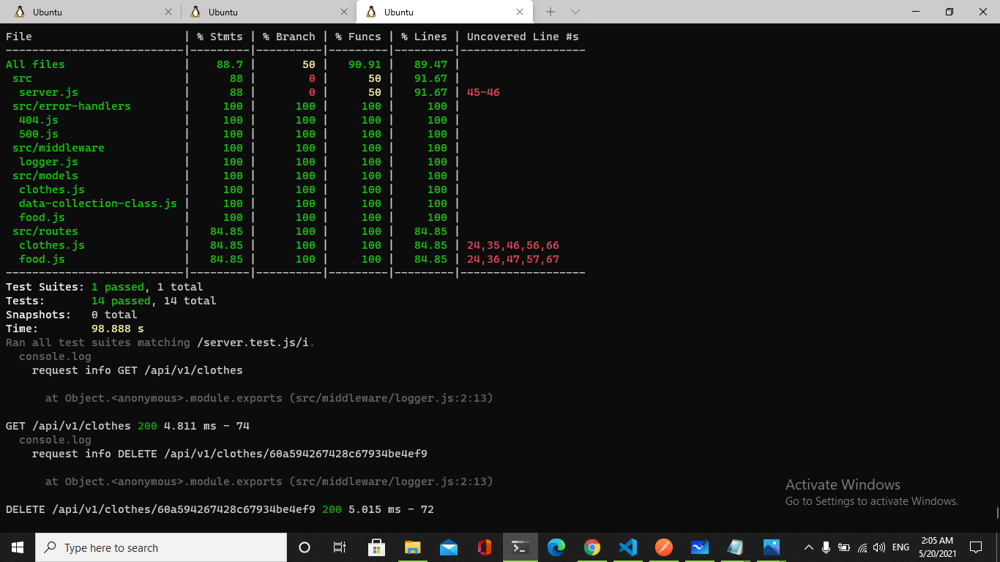
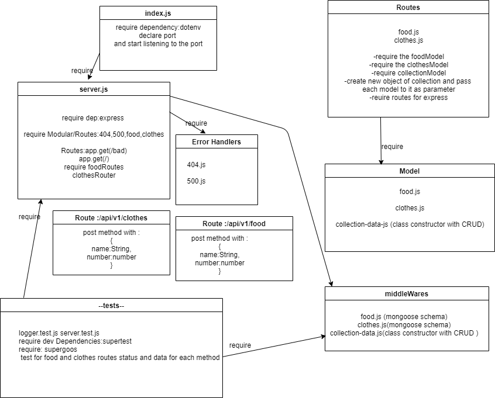

401 class 04 lab
# LAB - 04
## api-server
### Author: Neveen Beiram

* [deployment for main branch ](https://neveen-api-server.herokuapp.com/) .
* [submission PR](https://github.com/NeveenBeiram/api-server/pulls) .
* [tests report](https://github.com/NeveenBeiram/api-server/actions) .
 
### Setup

#### `.env` requirements

- `PORT` - 3000

#### Running the app

- `npm start`
- Endpoint: `/`
  - Returns message

    ```

    'welcome to server.js'

    ```

    
- Endpoint: `/bad`
  - Throws an error 500
  - Returns an Object

    ```

    {
        "status": 500,
        "message": "something went wrong ",
        "rout": "/err",
    }

    ```

- Endpoint: **anything else ..**
  - Returns an error 404
  - Returns an Object

    ```

    {
        "status": 404,
        "message": "Sorry , Page not Found"
    }

    ```
- Endpoint: `/food`
  - Gets the food Objects stored

  ```

  {
    "id": "21dd7d1c-4bc1-4dd8-8677-9d0cd213d614",
    "data": {
        "name": "eggs",
        "number": "10"
    },

    {
    "id": "21dd7d1c-4bc1-4dd8-8677-9d0cd213d615",
    "data": {
        "name": "milk",
        "number": "5"
    }
  }

  ```

- Endpoint: `/food/21dd7d1c-4bc1-4dd8-8677-9d0cd213d614`
  - Gets the food Objects stored according to id

  ```

  {
    "id": "21dd7d1c-4bc1-4dd8-8677-9d0cd213d614",
    "data": {
        "name": "eggs",
        "number": "10"
    }

  }
  
  ```
- Endpoint: `/food/21dd7d1c-4bc1-4dd8-8677-9d0cd213d614`
  - Gets the food Objects stored and Updates it according to id
  > ```"name": "eggs","number": "11"  ```
  
  

  ```

  {
    "id": "21dd7d1c-4bc1-4dd8-8677-9d0cd213d614",
    "data": {
        "name": "eggs",
        "number": "11"
    }
  }

  ```
  - Endpoint: `/food/21dd7d1c-4bc1-4dd8-8677-9d0cd213d615`
  - Gets the food Objects stored and Deletes it according to id

  ```

  {
    {
    "id": "21dd7d1c-4bc1-4dd8-8677-9d0cd213d615",
    "data": {
        "name": "milk",
        "number": "5"
    }
  }

  ```
  - Endpoint: `/clothes`
  - Adds on the clothes Objects stored 

  ```

  {
    "id": "31dd7d1c-4bc1-4dd8-8677-9d0cd213d614",
    "data": {
        "name": "T-shirt",
        "number": "10"
    },

    {
    "id": "31dd7d1c-4bc1-4dd8-8677-9d0cd213d615",
    "data": {
        "name": "shirt",
        "number": "5"
    },

    {
    "id": "41dd7d1c-4bc1-4dd8-8677-9d0cd213d616",
    "data": {
        "name": "pants",
        "number": "6"
    }
  }

  ```

- Endpoint: `/clothes`
  - Gets the clothes Objects stored

  ```

  
  {
    "id": "31dd7d1c-4bc1-4dd8-8677-9d0cd213d614",
    "data": {
        "name": "T-shirt",
        "number": "10"
    },

    {
    "id": "31dd7d1c-4bc1-4dd8-8677-9d0cd213d615",
    "data": {
        "name": "shirt",
        "number": "5"
    },

    {
    "id": "41dd7d1c-4bc1-4dd8-8677-9d0cd213d616",
    "data": {
        "name": "pants",
        "number": "6"
    }
  }

  ```
- Endpoint: `/clothes/31dd7d1c-4bc1-4dd8-8677-9d0cd213d614`
  - Gets the clothes Objects stored according to id

  ```

  {
    "id": "31dd7d1c-4bc1-4dd8-8677-9d0cd213d614",
    "data": {
        "name": "T-shirt",
        "number": "10"
    }

  }
  
  ```
- Endpoint: `/clothes/31dd7d1c-4bc1-4dd8-8677-9d0cd213d614`
  - Gets the clothes Objects stored and Updates it according to id
  > ```"name": "socks","number": "11"  ```
  
  

  ```

  {
    "id": "31dd7d1c-4bc1-4dd8-8677-9d0cd213d614",
    "data": {
        "name": "socks",
        "number": "11"
    }
  }

  ```
  - Endpoint: `/clothes/41dd7d1c-4bc1-4dd8-8677-9d0cd213d616`
  - Gets the clothes Objects stored and Deletes it according to id

  ```

  {
    {
    "id": "41dd7d1c-4bc1-4dd8-8677-9d0cd213d616",
    "data": {
        "name": "pants",
        "number": "6"
    }
  }

  ```
<hr>

#### Tests

- Unit Tests: `npm run test`



<hr>

#### UML



